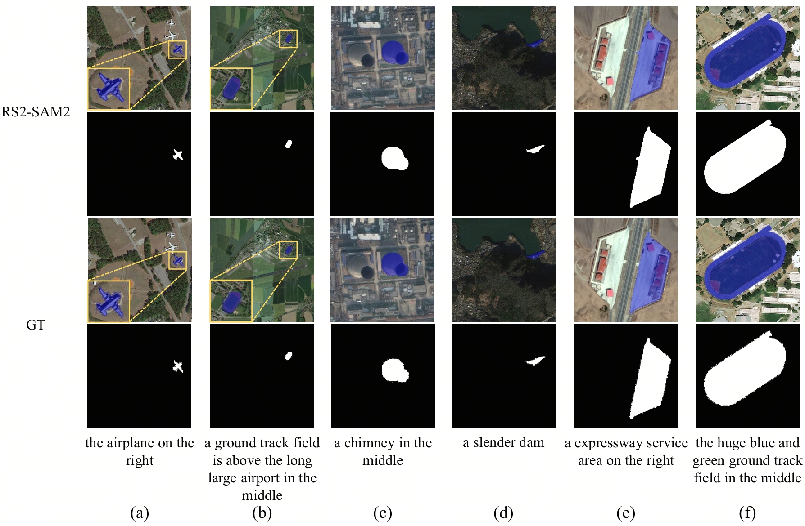
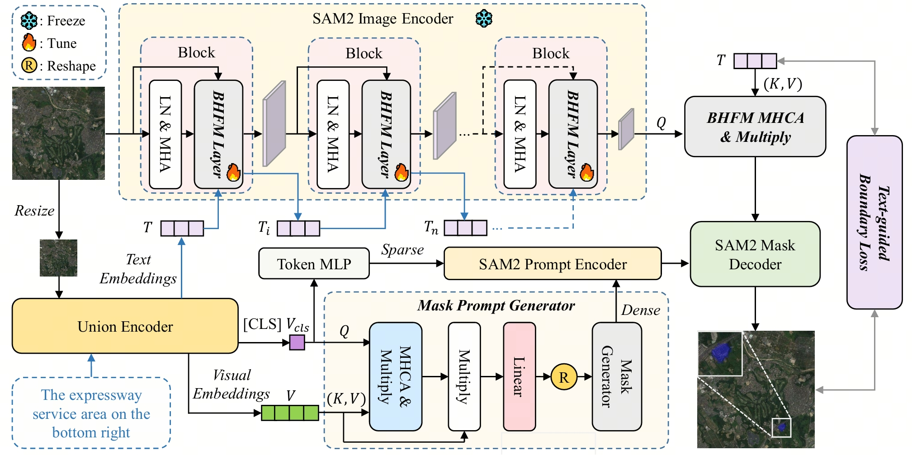

<div align="center">
  <h1>RS2-SAM2: Customized SAM2 for Referring Remote Sensing Image Segmentation</h1>
  <h3>AAAI 2026</h3>
  <a href="https://arxiv.org/abs/2503.07266">
    
  </a>
</div>



## News

[November 9th, 2025] 🔥RS2-SAM2 has been accepted by AAAI 2026! We have open-sourced the code and model.

## Contents

- [Framework](#framework)
- [Model](#model)
- [Installation](#installation)
- [Prepare](#prepare)
- [Training & Inference](#training--inference)
- [Acknowledgement](#acknowledgement)
- [Citation](#citation)

## Framework



## Model

Our model can be obtained from this Hugging Face link [RS2-SAM 2 · HF](https://huggingface.co/ReeF2025/RS2-SAM2). "rrsisd" refers to the model trained on the RRSIS-D dataset, and "refseg" refers to the model trained on the RefSegRS dataset.

## Installation

```bash
git clone https://github.com/rongfu-dsb/RS2-SAM2.git
cd RS2-SAM2
conda create -n RS2-SAM2 python=3.8
conda activate RS2-SAM2
pip install torch==2.0.1 torchvision==0.15.2 torchaudio==2.0.2 --index-url https://download.pytorch.org/whl/cu118
pip install -r requirements.txt
pip install 'git+https://github.com/facebookresearch/fvcore' 
pip install mmengine==0.10.5
pip install mmsegmentation==0.24.0
pip install wandb
```

## Prepare

### Datasets

We mainly used the RefSegRS and RRSIS-D datasets. For the data preparation process, please refer to [RMSIN](https://github.com/Lsan2401/RMSIN) and [LGCE](https://gitlab.lrz.de/ai4eo/reasoning/rrsis). Once the data is prepared, replace `./your_data` in the code with the path to your dataset.

```
── your_data
│   ├── RRSIS-D
│   │   ├── images
│   │   └── rrsisd
│   ├── RefSegRS
│   │   ├── images
│   │   ├── masks
│   │   ├── output_phrase_test.txt
│   │   ├── output_phrase_train.txt
│   │   └── output_phrase_val.txt
```

### Initial weights

In this link [BEiT-3](https://github.com/microsoft/unilm/tree/master/beit3), download the weights for BEiT-3-large and beit3.spm, and then replace `--encoder_pretrained` and `--version` accordingly. In this link [SAM2](https://github.com/facebookresearch/sam2), download the weights for sam2_hiera_large and replace `--vision_pretrained`.

## Training & Inference

##### RRSIS-D

```bash
bash fine.sh
```

##### RefSegRS

```bash
bash fine_rs.sh
```

## Acknowledgement

We borrow some code from the following works and would like to express our gratitude to them: [SAM2](https://github.com/facebookresearch/sam2), [EVF-SAM](https://github.com/hustvl/EVF-SAM), [RMSIN](https://github.com/Lsan2401/RMSIN), [BEiT-3](https://github.com/microsoft/unilm/tree/master/beit3).

## Citation

```
@article{rong2025customized,
  title={Customized SAM 2 for Referring Remote Sensing Image Segmentation},
  author={Rong, Fu and Lan, Meng and Zhang, Qian and Zhang, Lefei},
  journal={arXiv preprint arXiv:2503.07266},
  year={2025}
}
```
